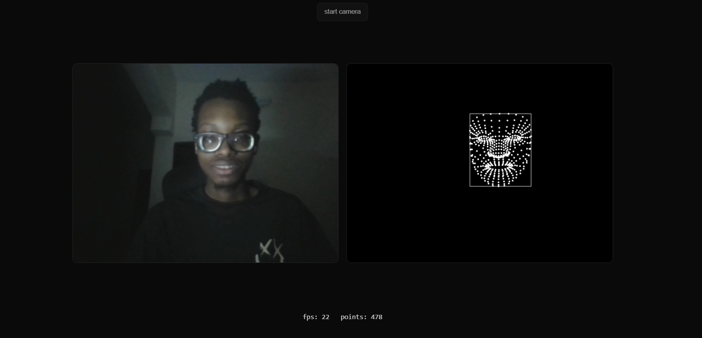

## `README.md`

# nano-face

tiny wrapper around [mediapipe face landmarker](https://developers.google.com/mediapipe/solutions/vision/face_landmarker)
→ **demo face tracking in javascript with 10 lines**.

```html
<!-- nano-face: face tracking in 10 lines -->
<video id="cam" playsinline muted></video>
<script type="module">
  import { createFaceTracker } from 'https://YOURNAME.github.io/nano-face/nano-face.js';

  const tracker = await createFaceTracker({
    video: '#cam',
    onResults: ({ landmarks }) => console.log(landmarks)
  });

  tracker.start();
</script>
```

---

no protobufs. no graphs. no local model downloads. just:

- 1 import
- 1 call
- plain arrays `[x, y, z]` and `{x, y, w, h}`

---

## quick demo

clone the repo and open the demo:

```bash
git clone https://github.com/YOURNAME/nano-face
cd nano-face
python -m http.server 5173
# open http://localhost:5173/demo.html
````

or check the live version: [github pages link](https://emmanuel-paulmaah.github.io/nano-face)

---

## usage

```html
<script type="module">
  import { createFaceTracker } from './nano-face.js';

  const tracker = await createFaceTracker({
    video: '#cam',          // <video> or selector
    draw: null,             // set to <canvas> if you want auto-draw
    onResults: ({ landmarks, box, fps }) => {
      console.log(landmarks, box, fps);
    }
  });

  tracker.start(); // tracker.stop() / tracker.close()
</script>
```

### results

* `landmarks`: `[[x,y,z], …]` normalized 0–1
* `box`: `{x,y,w,h}` normalized 0–1 (optional)
* `fps`: frames per second (number)

---

## api

```ts
createFaceTracker(options: {
  video: string | HTMLVideoElement
  draw?: string | HTMLCanvasElement   // optional auto-draw
  model?: string                      // default: hosted face_landmarker.task
  maxFaces?: number                   // default: 1
  wasmBaseUrl?: string                // default: hosted wasm
  onResults?: (r: { landmarks: [x,y,z][], box?: {x,y,w,h}, fps: number }) => void
}): Promise<{
  start(): void
  stop(): void
  close(): void
  advanced: { landmarker: any }       // raw mediapipe object
}>
```

---

## why not just mediapipe?

mediapipe is powerful but heavy:

* you wire up graphs, protobufs, configs
* you manage models + wasm yourself
* you parse packets into usable numbers

nano-face is **the 10% most people actually need**:

* hosted defaults (model + wasm)
* simple api (`create → start → results`)
* friendly outputs (`[[x,y,z]]` arrays)

you can still drop down to raw mediapipe via `tracker.advanced.landmarker`.

---

## demo

the included `demo.html` shows:

* **split screen**: left = camera, right = landmarks
* landmarks drawn in **white on black**



---

## roadmap

* [ ] optional face mesh lines
* [ ] configurable colors for demo
* [ ] blendshapes toggle

---

## license

MIT © 2025 Emmanuel PaulMaah
